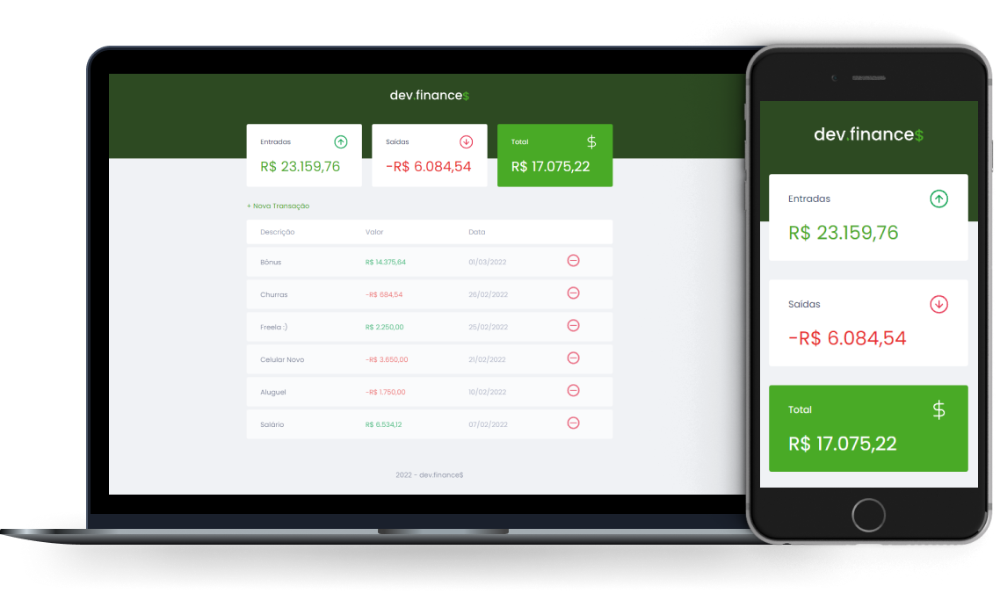

<h1 align="center">
  
</h1>

  <a href="#-tecnologias">Tecnologias</a> | <a href="#-projeto">Projeto</a> | <a href="#-layout">Layout</a>| <a href="#memo-licença">Licença</a>

  

 

  

<strong><a href="https://felipehac.github.io/dev-finances/">VER DEMO</a></strong>

## 🚀 Tecnologias

Esse projeto foi desenvolvido com as seguintes tecnologias:

- HTML
- CSS
- JavaScript

## 💻 Projeto

O dev.finance$ é uma aplicação de controle financeiro, onde é possível cadastrar e excluir transações e ver o saldo de entrada e saída 💰.

O projeto foi desenvolvido em HTML, CSS e JavaScript e utiliza o LocalStorage para guardar os dados transacionais.

## 🔖 Layout

Você pode visualizar o layout do projeto através [desse link](https://www.figma.com/file/7Vu9DzUaCZIV4nibzkjgB4/dev.finance%24-Maratona-Discover). É necessário ter conta no [Figma](https://figma.com) para acessá-lo.

## 📝 Licença

Esse projeto está sob a licença MIT. Veja o arquivo [LICENSE](LICENSE.md) para mais detalhes.

---
